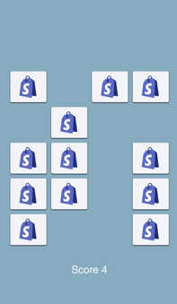

# Shopify
☀️ The app is a memory match game for shopify intern challenge 2020

   

## ☀️ About
Shopify is the a memory matching game using a JSON endpoint provided by Shopify 🌴

I had to build a memory matching game app for getting hired at [Shopify](https://www.shopify.com/). It took me sometimes but I came up with this little app where you i need to match 2 image from the shopify store.

Of course, I am still hoping to join the [Shopify](https://www.shopify.com/) 💻

## 💻 Requirements
Shopify is written in Swift and supports iOS 11.0+. Built with Xcode 10.
The user should have to find a minimum of 10 pairs to win. 
Keep track of how many pairs the user has found.
When the user wins, display a message to let them know!
Make sure it compiles successfully.

### Clone the project

Run `git clone git@github.com:fabricetiennette/Shopify.git`

### Project

Open `Sunly.xcodeproj`

Build & Run 🔥

## 🦁 TODO
 - Unit testing
 - UI testing
